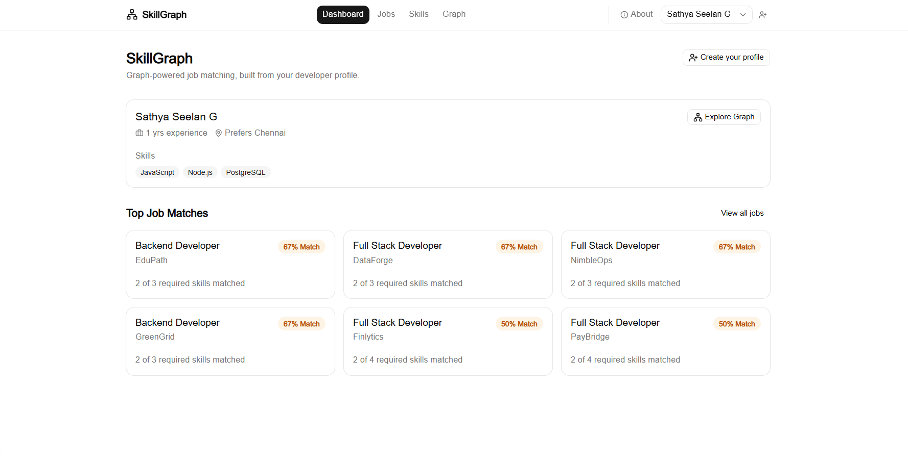
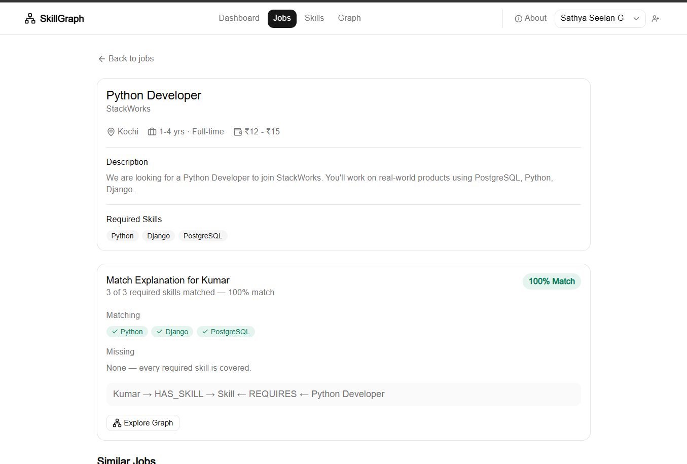
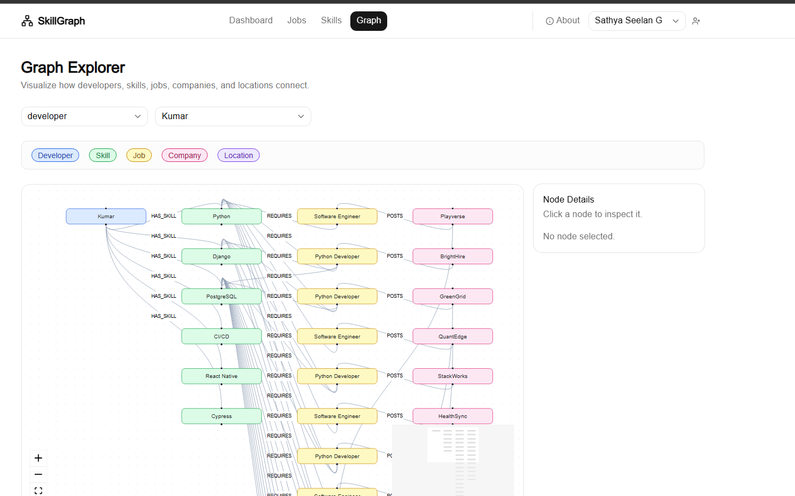
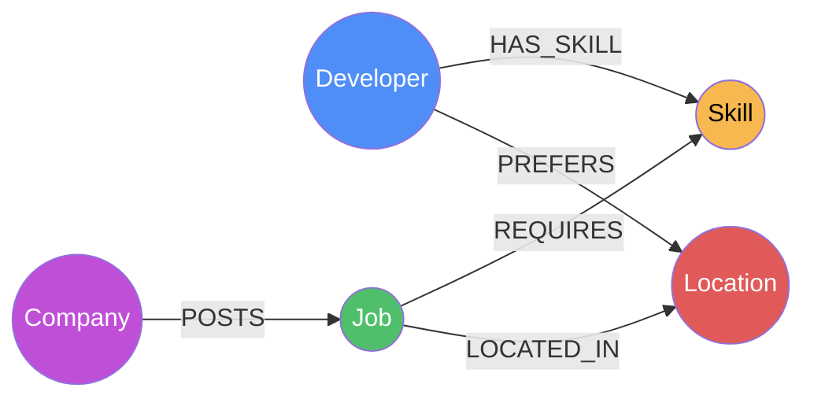
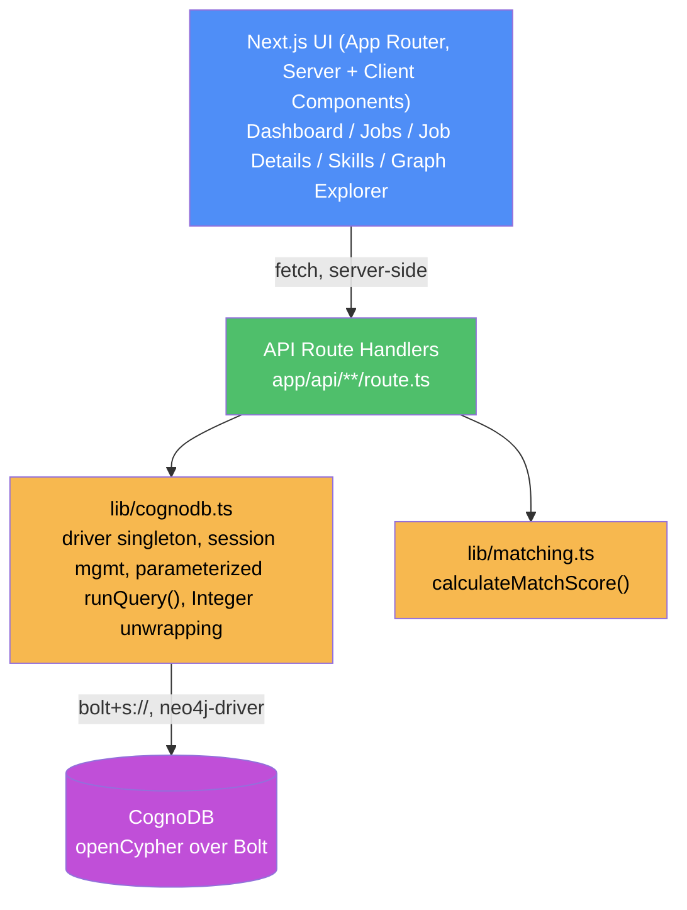
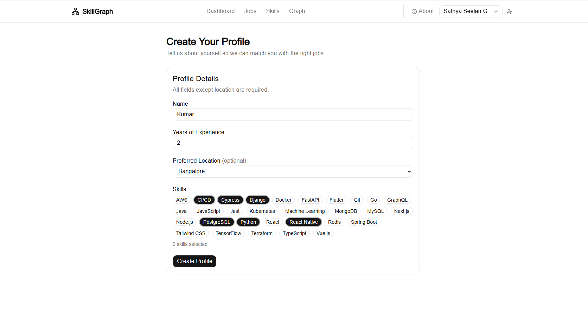
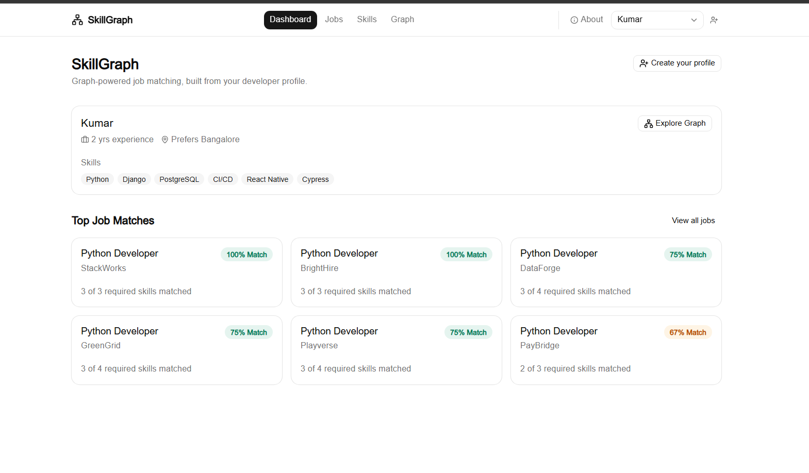

# SkillGraph

A graph-database-backed developer skill and job matching application, built on **CognoDB** (a managed graph database that speaks openCypher over the Bolt protocol) for the Wexa AI CognoDB take-home assignment.

SkillGraph lets a developer see which jobs best match their current skills, understand exactly why a job matches (which required skills they have and which they're missing), and explore the underlying graph of developers, skills, jobs, companies, and locations directly.

---

## Demo


*(Full-quality video: [docs/screenshots/demo.mp4](docs/screenshots/demo.mp4), also hosted at `<DEMO_URL_HERE>/demo.mp4` once deployed)*

**Dashboard** — a developer's profile card and their top job matches, ranked by match score.



**Job Details** — the match explanation renders the traversal directly: which required skills matched, which are missing, and the graph pattern that produced the result.



**Graph Explorer** — an interactive React Flow view of the subgraph around a selected developer: their skills, the jobs those skills unlock, and the companies posting them.



- **Hosted demo:** `<DEMO_URL_HERE>` — not deployed yet.
- **Screen recording:** see the gif above (or `<RECORDING_URL_HERE>` if a separate video is added).

---

## Table of Contents

- [Demo](#demo)
- [Problem Statement](#problem-statement)
- [Why a Graph Database?](#why-a-graph-database)
- [Data Model](#data-model)
- [Architecture](#architecture)
- [Setup](#setup)
- [Key Queries](#key-queries)
- [API Reference](#api-reference)
- [Screenshots](#screenshots)

---

## Problem Statement

Developers typically have several skills, and jobs typically require several skills — the relationship between the two is naturally many-to-many, and it doesn't stop there: jobs belong to companies, companies post many jobs, and jobs and developers both relate to locations.

A plain job listing can't answer the questions that actually matter to a developer:

- Which jobs best match my current skill set, and by how much?
- Of a job's required skills, which do I already have, and which am I missing?
- Which companies have jobs that overlap with my skills?
- Which other jobs are similar to a job I'm looking at, based on shared required skills?
- Which skills would unlock the most additional jobs if I learned them?

SkillGraph answers these by representing developers, skills, jobs, companies, and locations as a graph and querying the relationships directly, rather than bolting a recommendation feature onto a flat table of job postings.

---

## Why a Graph Database?

Every core feature in SkillGraph is a **traversal**, not a lookup — and several of them are traversals a relational schema handles awkwardly.

**1. The primary matching query is a 3-hop pattern, not a join chain that stays flat.**
Finding "jobs that match this developer" means walking `Developer -[:HAS_SKILL]-> Skill <-[:REQUIRES]- Job <-[:POSTS]- Company`. In Cypher this is one pattern match:

```cypher
MATCH (d:Developer {id: $developerId})-[:HAS_SKILL]->(s:Skill)<-[:REQUIRES]-(j:Job)<-[:POSTS]-(c:Company)
RETURN d.name, j.title, c.name, collect(DISTINCT s.name) AS matchingSkills
```

The equivalent in SQL requires a `developer_skills` junction table joined to `job_skills` joined to `jobs` joined to `companies` — four tables, three join conditions, and a `GROUP BY` to get the matching-skill count back out. The graph version reads as the relationship it represents; the relational version reads as an artifact of normalization.

**2. The skill-explorer aggregation is the query a relational database actively resists.**
`queries/skills.cypher` computes, for one skill: how many jobs require it, which companies post those jobs, which cities those jobs are in, and — separately — which *other* skills are most often required alongside it (skill co-occurrence across jobs):

```cypher
MATCH (s:Skill {id: $skillId})<-[:REQUIRES]-(j:Job)-[:REQUIRES]->(related:Skill)
WHERE related.id <> s.id
RETURN related.name AS relatedSkill, count(DISTINCT j) AS sharedJobs
ORDER BY sharedJobs DESC
```

This is a self-join of `job_skills` against itself in SQL — join the junction table to itself on `job_id`, filter out the skill matching itself, group by the other skill, count distinct jobs. It's not impossible in SQL, but it requires knowing to write a self-join in the first place, and it degrades further the moment you want *2-hop* co-occurrence (skills related through a shared job that shares another job) — each additional hop is another self-join. In Cypher it's the same one-line pattern, and adding a hop means adding one more `-[:REQUIRES]-()` segment.

**3. "Similar jobs" is a 2-hop self-comparison, which SQL also expresses as a self-join.**
`queries/jobs.cypher`'s related-jobs query finds other jobs sharing required skills with a given job:

```cypher
MATCH (j1:Job {id: $jobId})-[:REQUIRES]->(s:Skill)<-[:REQUIRES]-(j2:Job)
WHERE j1.id <> j2.id
```

Same story: a job-to-job similarity signal that only exists because both jobs point at the same skill nodes. The graph makes the connection a first-class thing you can pattern-match on; in a relational model it's an implicit consequence of two independent foreign keys that has to be re-derived with a join every time.

**4. The relationships are the product, not incidental foreign keys.** The UI's "why does this job match" explanation, the graph explorer, and the skill explorer are all direct renderings of graph traversals — `Developer -[:HAS_SKILL]-> Skill <-[:REQUIRES]- Job` is both the query and the sentence the UI shows the user. There's no translation layer between "how the data is stored" and "how the feature is explained," which is the argument for a graph database here: the interesting questions are about connections, not about rows.

None of this requires a large dataset to show real value — even at 50 jobs and 30 skills, the co-occurrence and similarity queries above return meaningfully different results per skill/job because the relationship density (180 `REQUIRES` edges across 50 jobs) is high enough for those patterns to matter.

---

## Data Model

**Nodes:** `Developer`, `Skill`, `Job`, `Company`, `Location`

**Relationships** (exact directions, as implemented in `scripts/seed.ts` and used consistently across every query and API route):

```
(:Developer)-[:HAS_SKILL]->(:Skill)
(:Job)-[:REQUIRES]->(:Skill)
(:Company)-[:POSTS]->(:Job)
(:Job)-[:LOCATED_IN]->(:Location)
(:Developer)-[:PREFERS]->(:Location)
```

> **Note on `POSTS` direction:** the original PRD (`prd.md`) was internally inconsistent — its schema section (§9) defines `(:Company)-[:POSTS]->(:Job)`, while its example-queries section (§11) uses a reversed, differently-named relationship, `(:Job)-[:POSTED_BY]->(:Company)`. This implementation standardized on `POSTS` (`Company -> Job`) as canonical, since that's what the primary schema section defines, and applied it consistently across the seed script, all five `.cypher` query files, and every API route. There is no `POSTED_BY` relationship anywhere in the actual graph.



### Node properties

| Node | Properties |
|---|---|
| `Developer` | `id`, `name`, `experienceYears` |
| `Skill` | `id`, `name`, `category` |
| `Job` | `id`, `title`, `description`, `experienceMin`, `experienceMax`, `salaryMin`, `salaryMax`, `employmentType`, `source`, `sourceUrl` |
| `Company` | `id`, `name`, `industry`, `website` |
| `Location` | `id`, `city`, `state`, `country` |

### Seed data

`scripts/seed.ts` (run via `npm run seed`) clears the graph and reloads it deterministically (seeded PRNG, seed `42`) with:

- 30 `Skill` nodes (React, TypeScript, Python, PostgreSQL, AWS, Docker, etc., each with a `category`)
- 10 `Location` nodes (Chennai, Bangalore, Hyderabad, Pune, Mumbai, Delhi, Coimbatore, Remote, Kochi, Gurgaon)
- 20 `Company` nodes
- 50 `Job` nodes, generated from 8 job-title archetypes (Frontend Developer, React Developer, Full Stack Developer, etc.), each linked to a company, a location, and 3–4 required skills
- 10 `Developer` nodes, each with a hand-authored skill set and preferred location (developer `d1`, "Sathya," matches the PRD's example profile: React, Next.js, TypeScript, Node.js, Python, PostgreSQL, based in Chennai)

Resulting relationship counts: `HAS_SKILL` 51, `LOCATED_IN` 50, `POSTS` 50, `PREFERS` 10, `REQUIRES` 180 — enough density for the multi-hop and co-occurrence queries to return non-trivial results.

---

## Architecture



- **Frontend** — Next.js 16 (App Router), TypeScript, Tailwind CSS, shadcn/ui, React Flow (`reactflow`) for the Graph Explorer. Server Components fetch data server-side via a shared `apiFetch()` helper; a few pages (Jobs, Skills, Graph) are Client Components because they respond to query-string state (search/filter/selection).
- **API layer** — Next.js Route Handlers under `app/api/`. Every route runs server-side only, validates input where relevant (e.g. `minExperience` must be numeric), and catches database errors into a generic, user-facing message — no stack traces, connection strings, or driver internals are ever returned to the client.
- **Database layer (`lib/cognodb.ts`)** — a singleton `neo4j-driver` `Driver`, created from `COGNODB_URI` / `COGNODB_USERNAME` / `COGNODB_PASSWORD` environment variables. Exposes `getSession()`, a parameterized `runQuery<T>(cypher, params)` helper (always opens and closes its own session), and `closeDriver()`. `runQuery()` recursively converts Neo4j's 64-bit `Integer` wrapper objects and `Node`/`Relationship` wrappers into plain JS numbers/objects before returning — see the [Integer-serialization fix](#a-note-on-integer-serialization) below.
- **Matching layer (`lib/matching.ts`)** — `calculateMatchScore(matchingSkills, requiredSkills)` = `round((matchingSkills / requiredSkills) * 100)`, with a divide-by-zero guard.
- **Database** — CognoDB, a hosted graph database speaking openCypher over Bolt (`bolt+s://`), accessed with the official `neo4j-driver` JavaScript driver — no custom SDK.

### A note on Integer serialization

CognoDB (like Neo4j) returns 64-bit integer fields (e.g. `matchingSkills`, `requiredSkills` counts from `count()`) as driver-side `Integer` wrapper objects (`{ low, high }`), not plain JavaScript numbers. Passing these straight into `NextResponse.json()` silently broke downstream arithmetic and produced malformed JSON. The fix, in `lib/cognodb.ts`, is a recursive `toPlainValue()` function that uses `neo4j.isInt()` + `.toNumber()` to unwrap integers, recurses into arrays and plain objects, and unwraps Neo4j `Node`/`Relationship` objects down to their `.properties`. It's applied once, inside `runQuery()`, so every API route benefits without needing to know about the quirk.

---

## Setup

### Prerequisites

- Node.js (compatible with Next.js 16 / React 19)
- A CognoDB Cloud account

### 1. Create a CognoDB instance

1. Sign up at [console.cognodb.com/signup](https://console.cognodb.com/signup) (free tier, no credit card required).
2. From the console, create a free (`c0`) instance and pick a region — it provisions in under a minute.
3. Copy the connection URI (form: `bolt+s://<instance-id>.databases.cognodb.cloud`) and the generated password for the user `cognodb`. **The password is shown exactly once** — save it immediately somewhere your app can read it as an environment variable. Never commit it.

### 2. Configure environment variables

Create `skillgraph/.env.local` (already git-ignored by Next.js's default `.gitignore`) with:

```env
COGNODB_URI=bolt+s://<your-instance-id>.databases.cognodb.cloud
COGNODB_USERNAME=cognodb
COGNODB_PASSWORD=<your-password>
```

A `.env.example` documenting these three variable names (with no real values) is included in the repo.

### 3. Install dependencies

```bash
cd skillgraph
npm install
```

### 4. Seed the database

```bash
npm run seed
```

This runs `tsx scripts/seed.ts`, which loads `.env.local`, **clears the graph** (`MATCH (n) DETACH DELETE n`), attempts to create uniqueness constraints on each node label's `id` (wrapped in try/catch, since CognoDB may not support every constraint syntax Neo4j does), and then creates all nodes and relationships described in [Data Model](#data-model) using parameterized Cypher throughout.

### 5. Run the application

```bash
npm run dev
```

Open [http://localhost:3000](http://localhost:3000).

Other available scripts (from `package.json`):

```bash
npm run build   # next build — production build
npm run start   # next start — run a production build
npm run lint     # eslint
```

---

## Key Queries

All Cypher lives in `queries/*.cypher`, documented with comments, and every query used by the application is parameterized through the official `neo4j-driver` (no string-concatenated Cypher anywhere).

### `matching.cypher` — job matching

The core feature. Finds jobs a developer matches, with a match count and a computed match score:

```cypher
MATCH (d:Developer {id: $developerId})-[:HAS_SKILL]->(s:Skill)<-[:REQUIRES]-(j:Job)
WITH j, count(DISTINCT s) AS matchingSkills
MATCH (j)-[:REQUIRES]->(allSkills:Skill)
WITH j, matchingSkills, count(DISTINCT allSkills) AS requiredSkills
RETURN j.id AS jobId, j.title AS title, matchingSkills, requiredSkills,
       round(100.0 * matchingSkills / requiredSkills) AS matchScore
ORDER BY matchScore DESC, matchingSkills DESC
```

A second query in the same file computes the matching/missing skill breakdown for one developer/job pair, using `OPTIONAL MATCH` to detect skills the developer does *not* have:

```cypher
MATCH (j:Job {id: $jobId})-[:REQUIRES]->(required:Skill)
OPTIONAL MATCH (d:Developer {id: $developerId})-[:HAS_SKILL]->(required)
RETURN required.name AS skillName, d IS NOT NULL AS matched
```

### `graph.cypher` — multi-hop traversal

The required 3-hop traversal, `Developer -> Skill -> Job -> Company`:

```cypher
MATCH (d:Developer {id: $developerId})-[:HAS_SKILL]->(s:Skill)<-[:REQUIRES]-(j:Job)<-[:POSTS]-(c:Company)
RETURN d.name AS developerName, j.id AS jobId, j.title AS jobTitle, c.name AS companyName,
       collect(DISTINCT s.name) AS matchingSkills
ORDER BY size(matchingSkills) DESC
```

This is what powers the Dashboard's job recommendations and the Job Details page's match explanation — one pattern match walks all three hops instead of three separate lookups glued together in application code. The same file also has subgraph queries (job-centered and developer-centered) that shape the data for the React Flow Graph Explorer.

### `skills.cypher` — relationship-based exploration

The Skill Explorer's core query, explicitly the "a relational database would find this awkward" query — for a given skill, it aggregates job count, the companies posting those jobs, and the cities those jobs are in, in a single traversal:

```cypher
MATCH (s:Skill {id: $skillId})<-[:REQUIRES]-(j:Job)<-[:POSTS]-(c:Company)
OPTIONAL MATCH (j)-[:LOCATED_IN]->(l:Location)
RETURN s.name AS skillName, count(DISTINCT j) AS jobCount,
       collect(DISTINCT c.name) AS companies, collect(DISTINCT l.city) AS locations
```

A related query in the same file finds skills that frequently co-occur with a given skill across jobs (see [Why a Graph Database?](#why-a-graph-database) for why this is the standout awkward-in-SQL case).

### `jobs.cypher` and `locations.cypher`

`jobs.cypher` holds the filtered job listing query (search/location/experience filters, all optional and parameterized), the single-job-detail query, and the 2-hop "related jobs via shared skills" query. `locations.cypher` holds the location-aware exploration query — a developer's preferred location traversed out to jobs located there, used as contextual information rather than a scoring input, per the product spec.

---

## API Reference

All routes are `GET`, live under `app/api/`, run entirely server-side, and never expose raw driver errors to the client.

| Route | Purpose |
|---|---|
| `GET /api/developers` | List all developers with their skills |
| `GET /api/developers/[id]` | Single developer + skills + preferred location (404 if not found) |
| `GET /api/developers/[id]/matches` | Job matches for a developer, ranked by match score — the core matching endpoint |
| `GET /api/jobs` | List jobs, with optional `search`, `locationId`, `minExperience` query params |
| `GET /api/jobs/[id]` | Single job detail plus related jobs via shared skills (404 if not found) |
| `GET /api/skills` | List all skills with job counts |
| `GET /api/skills/[id]` | Single skill detail (job count, companies, locations) plus related skills (404 if not found) |
| `GET /api/graph/job/[id]` | React-Flow-ready `{ nodes, edges }` subgraph centered on a job |
| `GET /api/graph/developer/[id]` | React-Flow-ready `{ nodes, edges }` subgraph centered on a developer, capped at 40 nodes |

---

## Screenshots

**Dashboard** — a developer's profile card and their top job matches, ranked by match score.


**Create Profile** — a non-technical developer builds their profile by picking skills, experience, and a preferred location.



**Dashboard after profile creation** — matches recompute immediately from the new profile's skill set.



**Job Details** — the match explanation renders the traversal directly: which required skills matched, which are missing, and the graph pattern (`Kumar → HAS_SKILL → Skill ← REQUIRES ← Python Developer`) that produced the result.


**Graph Explorer** — an interactive React Flow view of the subgraph around a selected developer: their skills, the jobs those skills unlock, and the companies posting them.


